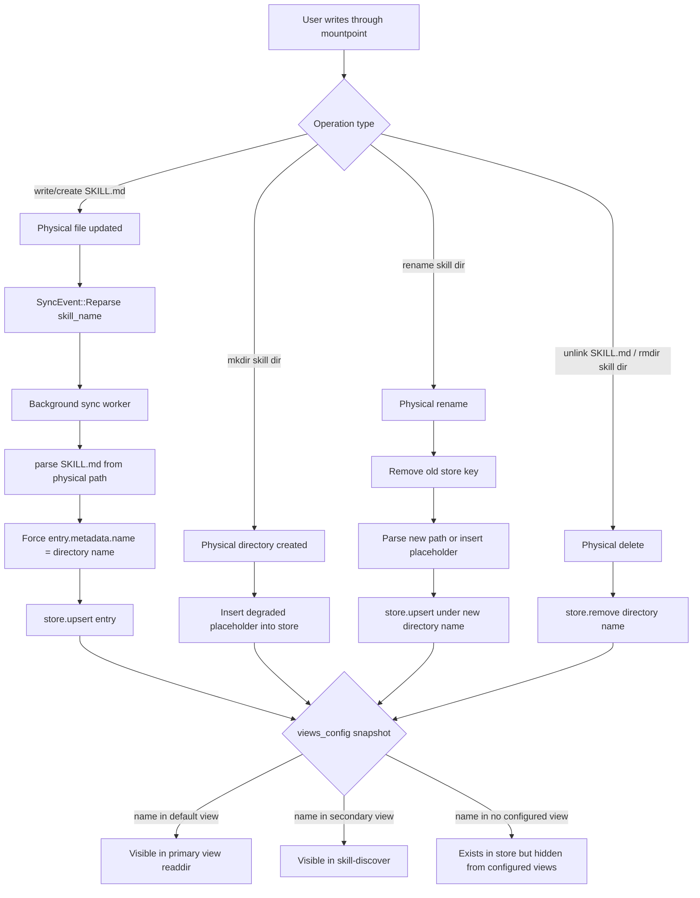

# SkillFS Architecture

**Version**: 2026-05 workspace state
**Status**: Implementation snapshot

---

## 1. Scope

workspace 当前产品面由三部分组成：

- `skillfs-core`
- `skillfs-fuse`
- `skillfs` CLI

SkillFS 当前已经从“纯只读 FUSE 视图”演进为“虚拟技能视图 + 物理写透传 + store 同步”的混合模型。

---

## 2. High-Level Architecture

```text
physical skills directory
  ├─ skill-a/SKILL.md
  ├─ skill-b/SKILL.md
  └─ category-x/skill-c/SKILL.md
            │
            ▼
      skillfs-core
        - parser
        - store
        - views
        - compiler
        - env
        - watcher (retained, not wired)
            │
            ▼
      skillfs-fuse
        - virtual readdir view
        - compiled SKILL.md read path
        - physical I/O passthrough
        - store sync worker
            │
            ▼
         skillfs CLI
        - mount
        - classify
        - validate
        - list
```

---

## 3. Runtime Data Flow

### 3.1 Load

1. CLI 根据 source 目录构建 `SkillStore`。
2. `SkillStore::load_from_directory` 解析所有 `SKILL.md`。
3. 如存在分类目录，读取 `_category.yaml` 的基本元数据。
4. 如存在 `skillfs-views.toml`，FUSE 启动时加载 views 配置。

### 3.2 Mount

1. CLI 调用 `skillfs-fuse::mount`。
2. FUSE 根据 views 决定 `/skills` 或 in-place 根目录中哪些技能可见。
3. `skill-discover` 始终可见，用于暴露 secondary views。
4. in-place 模式会预打开 source dir fd，并通过 `/proc/self/fd/{n}` 访问底层真实目录。

### 3.3 Read

1. Agent 或用户读取 `<skill>/SKILL.md`。
2. FUSE 读取真实 `SKILL.md`。
3. `compiler::compile` 基于 OS、命令和环境变量进行编译。
4. 返回编译后的内容。

### 3.4 Write / Sync

1. 用户通过挂载点执行 `write`、`create`、`mkdir`、`rename`、`unlink`、`rmdir` 或 `truncate`。
2. FUSE 将物理 I/O 透传到 source 目录。
3. 涉及 skill 目录结构变化时，FUSE 立即更新 store 或写入 degraded placeholder，保证可见性立即收敛。
4. 涉及 `SKILL.md` 内容变化时，后台 sync worker 重新解析文件并 `upsert` 到 store。
5. sync worker 统一使用目录名覆盖 `metadata.name`，保证目录名始终是 store 的权威 key。

### 3.5 Write -> Store -> Views Mapping



这张图对应当前实现的几个关键语义：

- 写操作先修改物理文件系统，再决定是否同步 store。
- 只有 `SKILL.md` 和 skill 目录结构变化会影响 store；普通透传文件不会改变视图。
- store 更新后不会自动修改 `skillfs-views.toml`，只会和挂载时加载的 views 配置做一次“名字交集”。
- 主视图是否可见，取决于该目录名是否在 default view 里。
- secondary view 是否可见，取决于该目录名是否在 secondary views 里；它通过 `skill-discover` 展示，而不是单独目录。
- rename 后即使 frontmatter `name:` 仍是旧值，store 也只认目录名，不会把旧 key 写回。

---

## 4. Configuration Model

运行时配置使用 `skillfs-views.toml`。

它决定：

- 默认 view 技能集合。
- secondary views 技能集合。
- `skill-discover` 展示内容。

注意：当前 store 同步不会自动修改或热重载 `skillfs-views.toml`；views 仍然是挂载时加载的配置快照。

---

## 5. Functional Matrix

| 能力 | normal mount | in-place mount | 当前状态 |
|------|--------------|----------------|----------|
| 视图过滤 `readdir` | 是 | 是 | 已实现 |
| 编译读取 `SKILL.md` | 是 | 是 | 已实现 |
| 读取其他物理文件 | 是 | 是 | 已实现 |
| 写 `SKILL.md` | 是 | 是 | 已实现，触发 reparse |
| `mkdir` 新 skill 立即可见 | 是 | 是 | 已实现 |
| `rename` skill 无空窗 | 是 | 是 | 已实现 |
| rename 后 stale frontmatter 不复活旧名 | 是 | 是 | 已实现 |
| `unlink` / `rmdir` 移除 store 条目 | 是 | 是 | 已实现 |
| `setattr(size)` truncate | 是 | 是 | 已实现 |
| `mknod` / `symlink` / `link` | `EROFS` | `EROFS` | 已实现 |

---

## 6. Runtime Consistency Boundaries

### 6.1 写路径一致性

- 通过挂载点执行的写操作会进入 FUSE 回调链并同步更新物理层与 store。
- 通过挂载点修改 `SKILL.md` 时，读取结果可在后续请求中反映最新编译内容。

### 6.2 视图配置一致性

- 挂载期 FUSE 回调不会写入或重写 `skillfs-views.toml`。
- 因此可能出现「views 名单与真实目录状态漂移」（例如重命名或删除后，toml 仍保留旧 skill 名）。
- 该漂移不会破坏 toml 文件格式。

### 6.3 normal 与 in-place 的关键差异

| 场景 | in-place (`source == mountpoint`) | normal (`source != mountpoint`) |
|------|-----------------------------------|----------------------------------|
| 通过挂载点修改 | 即时生效 | 即时生效 |
| 直接改 source（绕过挂载点） | 与挂载点同入口，通常等价 | 不保证即时生效 |

说明：normal 模式下，问题不在「是否挂到别处」，而在「是否绕过挂载点」。

- 通过挂载点路径进行读写：normal 与 in-place 都生效。
- 直接修改 source（绕过挂载点）：normal 下不保证即时同步到展示层与 store。

### 6.4 「可能需要重挂载」的判定规则

该描述用于覆盖不同变更类型的差异行为：

- 文件内容变更（已有 `SKILL.md`）：多数场景可直接反映。
- 目录结构/视图归属变更（新增、删除、重命名 skill，或修改 views）：通常需要重挂载才能稳定反映到展示层。
- normal 模式下绕过挂载点直接修改 source：可能需要重挂载或后续触发路径才能达成一致状态。

#### 6.4.1 路径可映射性说明

FUSE 写回调只会把可解析为技能路径的请求映射到底层 source。路径判定由 `parse_path` 与 `resolve_physical_path` 决定。

可映射路径：

- `SkillDir`
	- normal：`/mountpoint/skills/<skill>`
	- in-place：`/source/<skill>`
- `SkillMd`
	- normal：`/mountpoint/skills/<skill>/SKILL.md`
	- in-place：`/source/<skill>/SKILL.md`
- `Passthrough`
	- normal：`/mountpoint/skills/<skill>/<subpath>`
	- in-place：`/source/<skill>/<subpath>`

不可映射路径：

- `Root`
	- normal：`/mountpoint`
	- in-place：`/source`
- `SkillsDir`（仅 normal）
	- `/mountpoint/skills`
- `Invalid`
	- 不能解析为技能路径的请求，例如 normal 下 `mountpoint` 根目录下的非 `skills` 前缀路径。

不可映射路径的写操作不会落到底层 source，通常返回拒绝错误（常见为 `EROFS`）。

---

## 7. Scenario Comparison

### 7.1 挂载模式对比

「挂载模式」用于回答同一变更在 normal / in-place 下是否存在行为差异。

| 变更入口与类型 | in-place (`source == mountpoint`) | normal (`source != mountpoint`) |
|----------------|-----------------------------------|----------------------------------|
| 通过挂载点修改 `SKILL.md` | 回调触发；reparse 更新 store | 回调触发；reparse 更新 store |
| 通过挂载点 `mkdir/create/unlink/rmdir/rename` | 回调触发；同步物理层与 store | 回调触发；同步物理层与 store |
| 直接改 source 中已有 `SKILL.md`（绕过挂载点） | 与挂载点同入口 | 无回调；内容读取可能更新，store 不保证同步 |
| 直接改 source 目录结构（新增/删除/重命名 skill） | 与挂载点同入口 | 无回调；`/skills` 与 store 可能短时陈旧 |
| 挂载期间修改 `skillfs-views.toml` | 不热重载；重挂载生效 | 不热重载；重挂载生效 |

场景说明：

1. 通过挂载点修改：进入 FUSE 回调链，数据与展示通常同步。
2. normal 下绕过挂载点改 source 文件内容：可能出现「文件内容已变，列表/元数据未变」。
3. normal 下绕过挂载点改目录结构：常见「新目录已存在但列表未出现」或「旧目录已删但列表短时仍可见」。
4. 修改 views 文件：运行中不重载，重挂载后按新配置展示。

### 7.2 视图内/视图外对比

「视图内」表示 skill 在 default view；「视图外」表示不在 default view（可能属于 secondary 或未分配）。

| 变更类型 | 目标是否在 default view | 物理文件系统 | store | `/skills` | `skill-discover` | `skillfs-views.toml` |
|----------|--------------------------|--------------|-------|-----------|------------------|----------------------|
| 修改 `SKILL.md` 内容 | 视图内 | 更新 | reparse 后更新 | 继续可见 | 无变化 | 不变 |
| 修改 `SKILL.md` 内容 | 视图外 | 更新 | reparse 后更新 | 默认仍不可见 | 可在 secondary 展示 | 不变 |
| `mkdir` skill 目录（无 `SKILL.md`） | N/A | 创建 | 插入 placeholder | 有 views 时通常不进 default | 取决于 views 分配 | 不变 |
| 创建/写入新 `SKILL.md` | N/A | 创建并更新 | reparse 后入库 | 取决于 default view 列表 | 取决于 secondary 列表 | 不变 |
| `unlink SKILL.md` | 视图内 | 删除 | 立即 remove | 从 `/skills` 消失 | 对应条目消失 | 不变（可能陈旧） |
| `unlink SKILL.md` | 视图外 | 删除 | 立即 remove | 默认通常无变化 | 对应条目消失 | 不变（可能陈旧） |
| `rmdir` skill 目录 | 视图内 | 删除 | 立即 remove | 从 `/skills` 消失 | 对应条目消失 | 不变（可能陈旧） |
| `rmdir` skill 目录 | 视图外 | 删除 | 立即 remove | 默认通常无变化 | 对应条目消失 | 不变（可能陈旧） |
| `rename` skill 目录 | 视图内 | 改名 | key 切换到新目录名 | 旧名消失；新名取决于 default 列表 | 取决于 views 列表 | 不变（旧名仍在） |
| `rename` skill 目录 | 视图外 | 改名 | key 切换到新目录名 | 默认通常无变化 | 取决于 views 列表 | 不变（旧名仍在） |

说明：7.2 表描述「视图归属维度」的行为；若变更入口绕过挂载点，需同时参考 7.1 的挂载模式差异。

---

## 8. Test Coverage

当前关键验证集中在 `crates/skillfs-fuse/tests/write_guard_tests.rs`：

- normal mount
  - read path smoke test
  - write passthrough smoke test
  - `mkdir` 立即可见
  - `rename` 无空窗
  - post-rename write 不复活旧名
- in-place mount
  - `mkdir` 立即可见
  - `rename` 无空窗
  - post-rename write 不复活旧名
- 拒绝操作
  - `mknod` / `symlink` / `link` 返回 `EROFS`

---

## 9. Functional Highlights

- 虚拟视图与物理文件系统解耦：目录列表由 views + store 决定，物理文件仍来自 source。
- `SKILL.md` 读写分离：read 返回编译结果，write 修改原始文件。
- 目录名是统一权威 key：重命名后即使 frontmatter `name:` 滞后，也不会把旧名字重新写回 store。
- in-place 模式通过 dir fd 绕行 FUSE 自身，避免 over-mount 自回环。

---

## 10. Remaining Deferred Work

保留但未接线：

- watcher 模块

如果未来继续扩展，可能的方向是：

- 接入 watcher 做绕过挂载点写入的兜底同步
- 继续收缩分类目录相关元数据
- 为 `skillfs-views.toml` 定义热重载或刷新策略

---

## 11. Validation Baseline

已验证：

- `cargo test -p skillfs-core`
- `cargo test -p skillfs-fuse`
- `cargo check -p skillfs -p skillfs-fuse`
